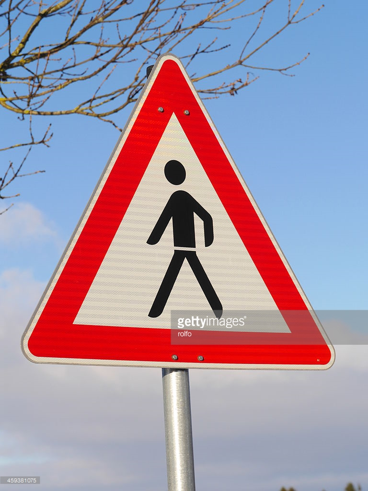
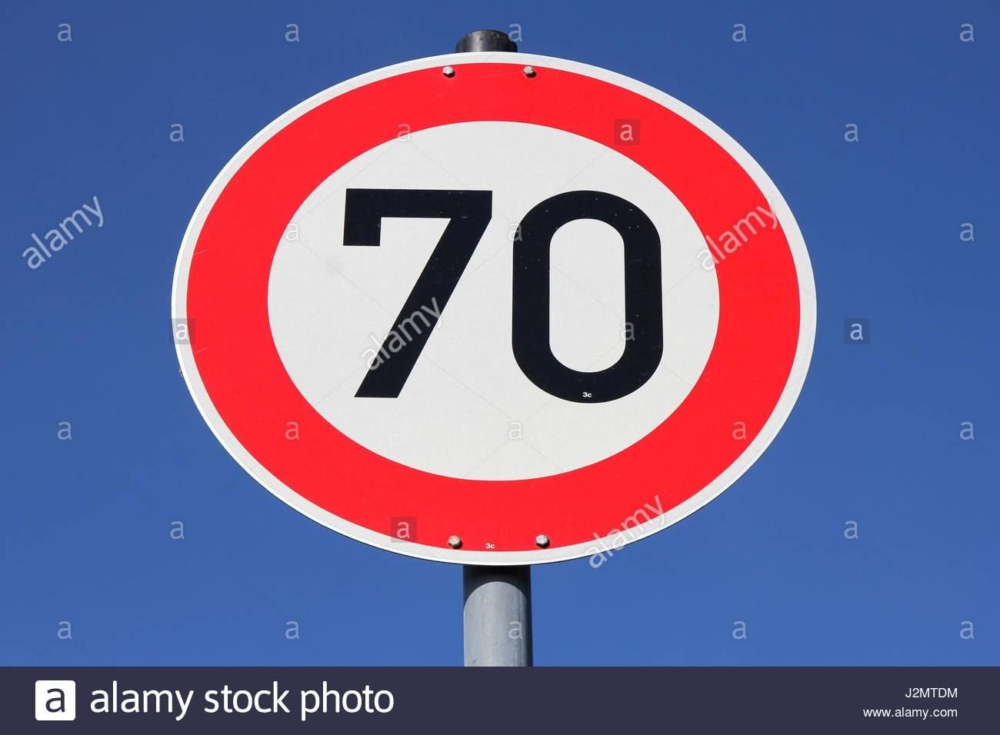

# **交通號誌辨識** 

**建立交通號誌便是專案**

安裝：

```shell
git clone https://github.com/KUASWoodyLIN/Udacity-self-driving-car-challenge-2.git
mkdir data
cd data

wget https://d17h27t6h515a5.cloudfront.net/topher/2017/February/5898cd6f_traffic-signs-data/traffic-signs-data.zip

unzip traffic-signs-data.zip
rm traffic-signs-data.zip
```

步驟：

* Step 0.載入[交通號誌資料集](https://d17h27t6h515a5.cloudfront.net/topher/2017/February/5898cd6f_traffic-signs-data/traffic-signs-data.zip)
* Step 1.資料集簡視與影像可視化函式編寫
* Step 2.資料的前處理
* Step 3.建立網絡模型
  * Fully connected layer function
  * Convolutional layer function
  * Placehonder：輸入、輸出
  * 模型結構：6層conv、4層fc
  * Loss function：softmax cross entropy
  * Optimizer：Adman
  * 定義評估函式：accuracy (準確率)
* Step 4.訓練網絡模型
  * Epochs：50
  * Batch size：128
* Step 5.測試網絡模型
  * 測試從website 上下載的8張圖片
  * 測試test dataset的圖片
  * 顯示最高的5個機率
* (Optional) 可視化Convolutional layer網絡輸出


[//]: # "Image References"

[image1]: ./examples/visualize_dataset.png "visual data information"
[image2]: ./examples/visualize_images.png "Visual image"
[image3]: ./examples/no_noise.png "Original image"
[image4]: ./examples/noise.png "Add noise image"
[image5]: ./examples/trainingdata.png "Training Dataset"


## Rubric Points
### Data Set Summary & Exploration


- [x] Ipython notebook

- [x] HTML File

- [x] Writeup report (markdown)

      ​

#### 1. Provide a basic summary of the data set. In the code, the analysis should be done using python, numpy and/or pandas methods rather than hardcoding results manually.

I used the pandas library to calculate summary statistics of the traffic
signs data set:

* The size of training set is ?	
  34799
* The size of the validation set is ?
  4410
* The size of test set is ?
  12630
* The shape of a traffic sign image is ?
  32x32x3
* The number of unique classes/labels in the data set is ?
  43

#### 2. Include an exploratory visualization of the dataset.

1. 使用值方圖將dataset的每個類別數量顯示出來。

   ![alt text][image1]

2. 圖像可是視化函式，一次輸出8筆圖像在畫面終，並且在圖像上方標上類別。

   ![alt text][image2]

### Design and Test a Model Architecture

#### 1. Preprocessed the image data. 

1. 打亂資料集：由於剛開始讀入資料時都是有排序的，將資料及打散可以有效增加網絡的正確率。

   ```python
   X_train, y_train = shuffle(X_train, y_train)
   ```

2. 正規化(normalization)：這裡使用的是min-max normaliaztion，將影像由0~255範圍，變成0~1的範圍。

   ```python
   X_train = (X_train / 255.).astype('float32')
   X_valid = (X_valid / 255.).astype('float32')
   X_test  = (X_test  / 255.).astype('float32')
   ```

3. 噪音(noise)：現實中影像常會受到霧氣、雨、雪、懸浮粒子等等影響，在訓練時加入噪音可以有效預防這些情況。

   ```python
   def noisy(image):
       row,col,ch = image.shape
       s_vs_p = 0.5
       amount = 0.004
       out = np.copy(image)
       # Salt mode
       num_salt = np.ceil(amount * image.size * s_vs_p)
       coords = [np.random.randint(0, i - 1, int(num_salt))
             for i in image.shape]
       out[coords] = 1

       # Pepper mode
       num_pepper = np.ceil(amount* image.size * (1. - s_vs_p))
       coords = [np.random.randint(0, i - 1, int(num_pepper))
             for i in image.shape]
       out[coords] = 0
       return out
   ```
   ​			![alt text][image3]![alt text][image4]

   ​

4. 影像縮放、平移、調亮度等等增加數據量方法，都是有效提高訓練結果的方法，而交通號誌的數據庫本身都已經有做以上，處理如下圖所示。

   ![alt text][image5]

   ​

#### 2. Model Architecture

My final model consisted of the following layers:

| Layer         		|     Description	        					|
|:---------------------:|:---------------------------------------------:|
| Input         		| 32x32x3 RGB image   							|
| Convolution 5x5    | 1x1 stride, same padding, outputs 32x32x32 |
| Convolution 3x3	| 1x1 stride, same padding, outputs 32x32x32 |
| Max pooling	      	| 2x2 stride,  outputs 16x16x32 		|
| Convolution 3x3	| 1x1 stride, same padding, outputs 16x16x32 |
| Convolution 3x3	| 1x1 stride, same padding, outputs 16x16x64 |
| Max pooling	| 2x2 stride,  outputs 8x8x64 |
| Convolution 3x3 | 1x1 stride, same padding, outputs 8x8x128 |
| Convolution 3x3 | 1x1 stride, same padding, outputs 8x8x256 |
|Max pooling|2x2 stride,  outputs 4x4x256|
|Fully connected|input 4096, outputs 256|
|Fully connected|input 256, outputs 128|
|Fully connected|input 128, outputs 43|


#### 3. Trained Model. The discussion can include the type of optimizer, the batch size, number of epochs and any hyperparameters such as learning rate.

* Leraning：0.0015
* Optimizer : 這裡使用Adam優化器，最多人使用的一種，裡面的參數使用預設值就可以訓練出很好的效果。
* Batch size：128。
* epochs：訓練50回，並將Accuracy最高的Model存儲起來。

#### 4. Describe the approach taken for finding a solution and getting the validation set accuracy to be at least 0.93. Include in the discussion the results on the training, validation and test sets and where in the code these were calculated. Your approach may have been an iterative process, in which case, outline the steps you took to get to the final solution and why you chose those steps. Perhaps your solution involved an already well known implementation or architecture. In this case, discuss why you think the architecture is suitable for the current problem.


My final model results were:
* training set accuracy of ? 0.9989
* validation set accuracy of ?  0.9505
* test set accuracy of ? 0.9374

If an iterative approach was chosen:
* What was the first architecture that was tried and why was it chosen? 
  LeNet, 這是之前練習時使用的架構。
* What were some problems with the initial architecture?
  之前的LeNet架構網絡太淺了，訓練到的特徵數不多，且輸出為10，並須更改為43個輸出。
* How was the architecture adjusted and why was it adjusted? Typical adjustments could include choosing a different model architecture, adding or taking away layers (pooling, dropout, convolution, etc), using an activation function or changing the activation function. One common justification for adjusting an architecture would be due to overfitting or underfitting. A high accuracy on the training set but low accuracy on the validation set indicates over fitting; a low accuracy on both sets indicates under fitting.
  * 增加convolution層(增加可以學習到的特徵)
  * 增加Fully connected層(學習非線性)
  * 適當的pooling層，加快網絡速度
  * 訓練50回存下validation data 驗證後Accuracy值最高的網絡
* Which parameters were tuned? How were they adjusted and why?
  * 改變convolution層中的filters，越多的filters可以學習到越多資訊
  * 改變Fully connected的outputsize
* What are some of the important design choices and why were they chosen?
  * dropout：可以避免overfitting問題，但也可以透過觀察training loss和 validation loss來避免overfitting

If a well known architecture was chosen:
* What architecture was chosen?

  這裡我參考VGG的架構，並將conv layer 縮小避免訓練時間太長

* Why did you believe it would be relevant to the traffic sign application?
  因為VGG網絡被驗證在更為複雜的dataset上，且可以分類1000個類別，所以交通號誌的訓練當然有好的成果

* How does the final model's accuracy on the training, validation and test set provide evidence that the model is working well?
  是的，最後在test set 的準確率也有0.9374%


### Test a Model on New Images

#### 1. Choose five German traffic signs found on the web and provide them in the report. For each image, discuss what quality or qualities might be difficult to classify.

這裡從網頁上找了8個交通號誌的圖片

  


#### 2. Discuss the model's predictions on these new traffic signs and compare the results to predicting on the test set. At a minimum, discuss what the predictions were, the accuracy on these new predictions, and compare the accuracy to the accuracy on the test set (OPTIONAL: Discuss the results in more detail as described in the "Stand Out Suggestions" part of the rubric).

Here are the results of the prediction:

| Image			        |     Prediction	        					|
|:---------------------:|:---------------------------------------------:|
| Speed limit (30km/h) | Speed limit (30km/h) |
| Perestrains | Speed limit (70km/h) |
| Speed limit (70km/h)	| Speed limit (70km/h)	|
| Priority road	| Priority road	|
| No entry	| No entry     |
| General caution	| General caution |
| Road work	| Road work |
| Turn right ahead	| Ahead only |

網絡從8張影像中正確分辨出6張影像，正確率為75%。這準確率與test dataset的準確率有落差，可能是因為resize後的images有變形或web上下載的影像有浮水印所造成的關西。

#### 3. Describe how certain the model is when predicting on each of the five new images by looking at the softmax probabilities for each prediction. Provide the top 5 softmax probabilities for each image along with the sign type of each probability. (OPTIONAL: as described in the "Stand Out Suggestions" part of the rubric, visualizations can also be provided such as bar charts)

The code for making predictions on my final model is located in the 11th cell of the Ipython notebook.

For the first image, the model is relatively sure that this is a stop sign (probability of 0.6), and the image does contain a stop sign. The top five soft max probabilities were

| Probability         	|     Prediction	        					|
|:---------------------:|:---------------------------------------------:|
| 99.99%         			| Speed limit (30km/h) 						|
| 100%     				| Speed limit (70km/h) 							|
| 100%					| Speed limit (70km/h)							|
| 	      			| Priority road					 				|
| .01				    | No entry      							    |
| .05					| General caution								|
| .04	      			| Road work					 			     	|
| .01				    | Ahead only      					     		|

For the second image ... 

### (Optional) Visualizing the Neural Network (See Step 4 of the Ipython notebook for more details)
#### 1. Discuss the visual output of your trained network's feature maps. What characteristics did the neural network use to make classifications?


